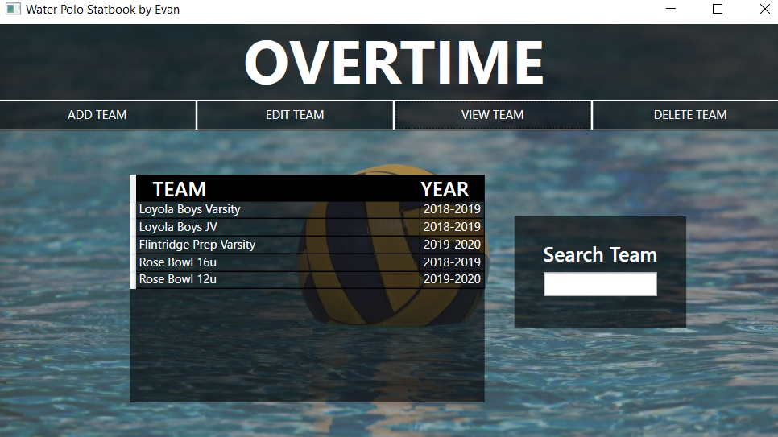
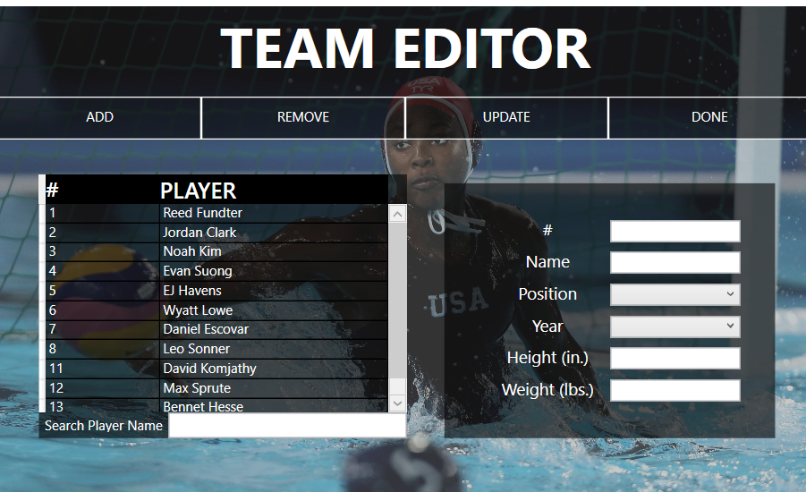
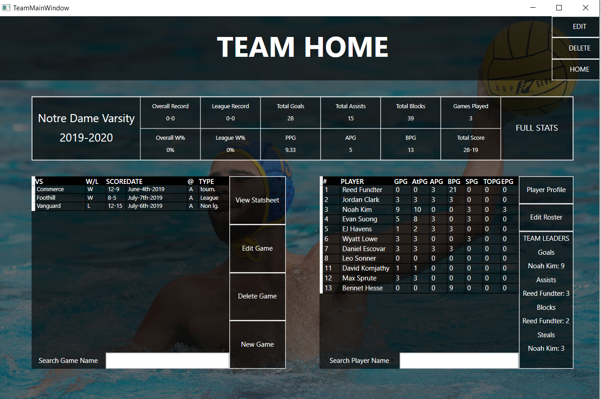
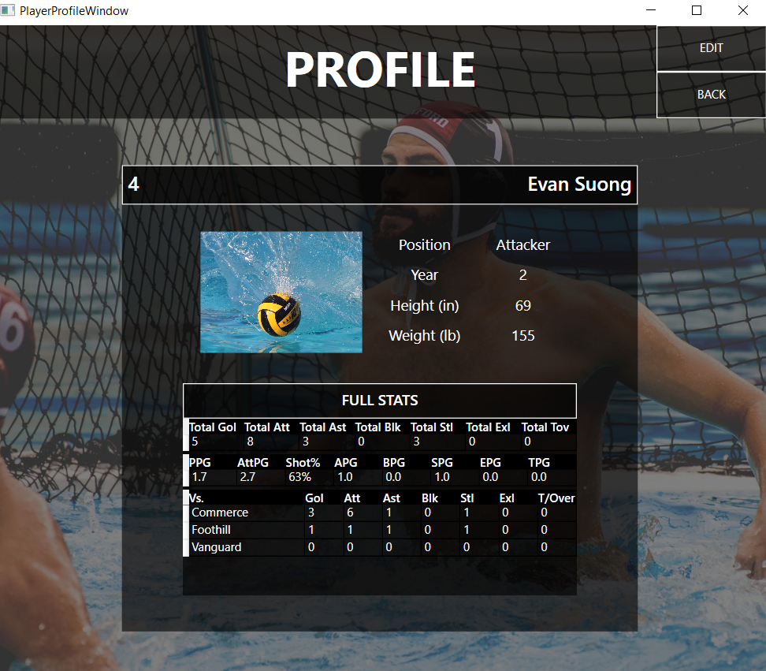
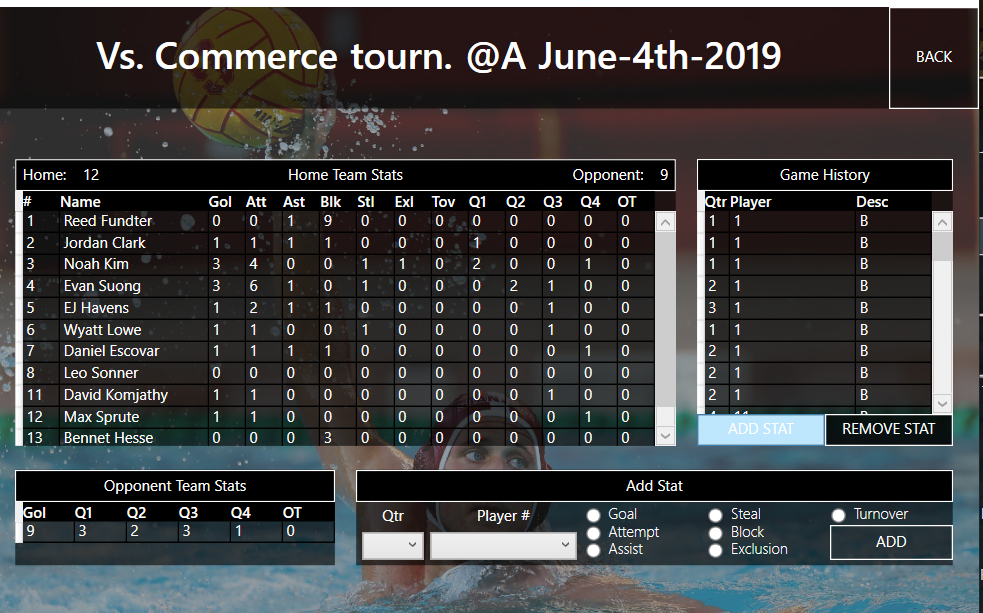

The Overtime Statbook v1.0 is a water polo statbook utility that keeps record of multiple water polo team stats throughout a season. This tool interacts with SQL Server to store, analyze, and present goals, assists, steals, blocks, exclusions, and turnovers of players and teams throughout their respective seasons. 

This tool can be used by coaches, players, and staff to keep track of team records, win/loss percentages, shot percentages, and much more. 

The program starts up at team home, where the user can select, add, or delete their water polo teams. The user can navigate to their teams with the 'view team' button which takes the user to their team's window which displays a statistical summary of a team's season, as well as summaries of each player on the team, and each game the team has played. The user can view the profile of each player to see a full rundown of each player's stats and information. 

The user inserts stats into the team's database by creating a new game, in which the user will be taken to the game's statsheet where stats can be inserted into the game by quarter. This statsheet is much like a real life statbook page where the user inserts game events as the game proceeds. When the user exits the game sheet all stats will from each game are stored and updated in all other pages. 

This tool is meant to help water polo staff keep better track of how their team is doing as a whole, as well as the progress and performance of each player on their team. Rather than having to manually count up all goals, shot percentages, turnovers, etc. etc, they are neatly presented with all necessary information that will contribute to a team's success. 

Some screenshots:

